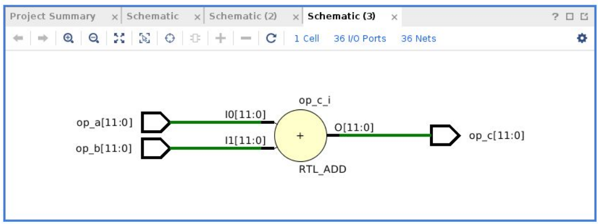
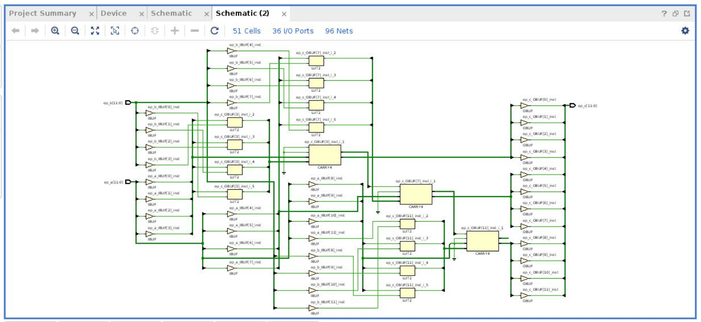
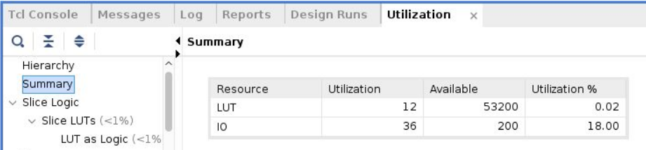
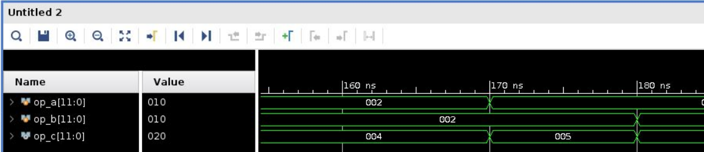
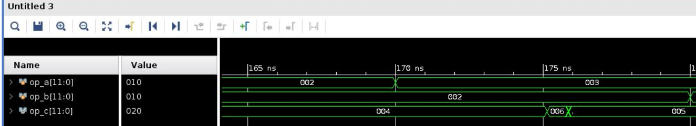

# Creating an Adder (Guided Exercise)

This is a guided exercise that illustrates how to work with RTL to describe a simple Fixed-Point adder of 12-bits. This small exercise will allow you to:

1. Seeing how an adder can be implemented (quite easy actually)
2. Running the Vivado Tool chain from a script
3. Looking and analysing simulations
4. Looking and analysing schematics
5. Analysing between what's described and what's actually implemented.

## Look at the code

* The actual adder implementation in Verilog: [adder.v](./src/adder.v)
* The testbench in Verilog: [tb_adder.v](./src/tb_adder.v)
* The execution script: [script.tcl](./src/script.tcl)

## Run the script to generate the project and products

```bash
cd src
vivado -mode tcl -source script.tcl 
```

## Viewing the schematic

There are two kinds of schematics:

1. The basic description in terms of behaviour:

Go to RTL Analysis > Open Elaborated Design > Schematic

You should look at something like this:



2. The RTL after synthesis, which represents the actual implementation on the FPGA:

Go to SYNTHESIS > Open Synthesise Design > Schematic

You should look at something like this:



## Viewing the resource utilisation

This is the resource consumption in terms of FPGA resources

Go to SYNTHESIS > Open Synthesise Design > Report Utilization

A new tab will appear below. Expand the "Summary one":



## Viewing the simulations

There are two kinds of simulations:

1. The behavioural simulation, which checks that the logic is correct.

Click on SIMULATION > Run Simulation > Run Behavioural Simulation

You can notice the transitions like the following:



2. The post-synthesis simulation, which checks that the logic is correct after the implementation in RTL.

Click on SIMULATION > Run Simulation > Run Post-Synthesis Timing Simulation

You can notice the transitions like the following:



## Questions

1. What is the difference between the schematics? Is there any reason why the post-synthesis is different than the behavioral?
2. What is the difference between the simulations? Is there any reason why we can see glitches in the post-synthesis? 
