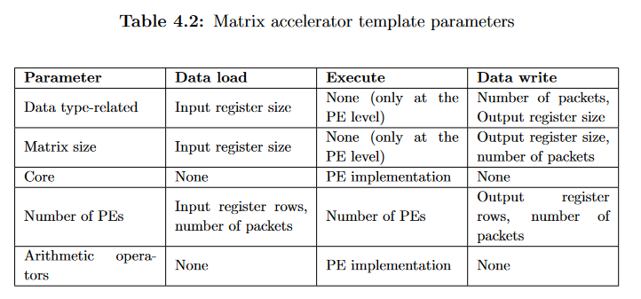
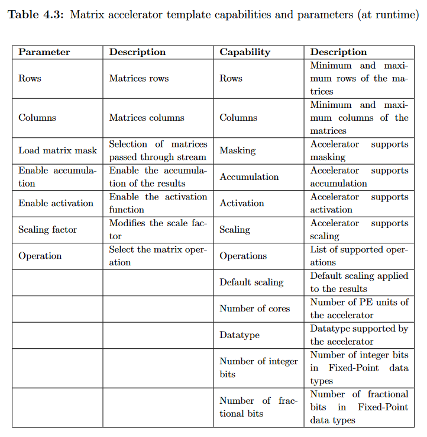

# Tanh(x) Streaming Accelerator

## Getting Started

1. Initialise the repository

```bash
git submodule update --init --recursive
cd tanh
```

If it does not work, please, remove the folder tanh and try to clone it:

```bash
git clone https://gitlab.com/ecas-lab-tec/approximate-flexible-acceleration-ml/flexible-accelerators-library-fal.git -b feature/add-point-wise-accelerator tanh
cd tanh
git submodule update --init --recursive
```

2. Go to `examples/activations` and have a look at the code. Identity the following files and answer the questions:

[**Core Implementation File (stream-activations-core.cpp)**](tanh/examples/activations/stream-activations-core.cpp)

In the Flexible Accelerators Library, the accelerator is a wrapper that takes care of the communication, the register registration and interface management. It offers the following template params:



The accelerator wrapper is composed of three parts:

a. The Accelerator Capabilities (`SET_MATRIX_CAPABILITIES`)

This code block defines the capabilities of the accelerator that refers to the runtime capabilities.

In this case, it is a matrix-like accelerator, where the rows and columns are inherent properties of the matrix processed by the accelerator.

For instance:

`WRITE_RANGE_CAP(rows, kRows, kMatrixMaxSize)` defines the "rows" can range from `kRows` up to `kMatrixMaxSize`.

It can also disable capabilities, like matrix load masking, result's accumulation, activation function (in this case, this is an activation accelerator) and the default scaling.

For more details, refer to the following table:



b. The Accelerator Capabilities (`SET_MATRIX_PARAMS_CHECK`)

This code block checks the runtime params in conformance to the capabilities of the accelerator. For instance:

`CHECK_RANGE_AND_FALLBACK(rows, kRows, kMatrixMaxSize, kRows)` makes sure that the number of rows passed by the user falls between `kRows` and `kMatrixMaxSize`. Otherwise, it returns the minimum. The user must check if the value was actually accepted.

c. The Accelerator Top Function (`TOP_MATRIX_FUNCTION`)

The top function acts as the top level module or the "main" function of the accelerator. It executes the capabilities, params check and top function in that order. For illustration:

```c++
void main() {
    activations_capabilities()
    activations_params_check()
    activations_accel()
}
```

However, there is no such thing as the main function as illustrated in the previous exercises.

With that said, the accelerator function itself has the following submodules:

c.1. `load_data(...)`: loads the data from the streaming port

c.2. `execute(...)`: performs the execution. It is where the actual algorithm is performed

c.3. `retrieve_data(...)`: writes the results back to the streaming port

For more details about the implementation, please, have a look at the following file.

[**Hardware Implementation File (stream-activations-hw.cpp)**](tanh/examples/activations/stream-activations-hw.cpp)

This is the actual implementation of the accelerator. You can observe how the data is got from the streaming port and loaded into a matrix. It requires to be in this way since they are not stored contiguously but registered into separate registers.

On the other hand, you can observe how the data is pumped out from the matrix to the output streaming port.

Finally, you can observe the implementation of the execution, which is fully parametric.

For the internal implementation, you can have a look at the following files:

_LUT Implementation_

* [LUT implementation](tanh/math/axc-math/approximate/tanh-lut.hpp)
* [Interpolator implementation](tanh/math/axc-math/approximate/interpolation-wrapper.hpp)

_Matrix Wrapper_

* [Matrix Map](tanh/matrix/includes/hw-ops/MatrixMap.hpp)
* [Parallel Matrix Operator](tanh/matrix/includes/hw-ops/VectorMatrix.hpp)

[**Testbench File (stream-activations-tb.cpp)**](tanh/examples/activations/stream-activations-tb.cpp)

It performs the following operations:

* Matrix extraction (matrix slicing)
* Matrix upload/download
* Testbench and results' extraction

## Instructions

1. Move the directives file:

```bash
cd tanh/examples/activations
cp stream-activations.tcl stream-activations.tcl.bk 
```

2. Replace the contents of [stream-activations.tcl](tanh/examples/activations/stream-activations.tcl) by:

```tcl
set_directive_top -name $::env(TOP_FUNCTION) "$::env(TOP_FUNCTION)"
```

3. Run the simulation. You can tune the following options:

| Option                | Possible Values     | Description                                  |
|-----------------------|---------------------|----------------------------------------------|
| Q_BW                  | 4-16                | Total data width                             |
| Q_INT                 | 1 < Q_BW            | Number of bits of the integer part           |
| Q_PES                 | 1-8                 | Number of PEs (cores)                        |
| Q_POINTS              | 4 - 128 (power of 2)| Number of points of the LUT                  |
| Q_MIN_NUM             | -inf - 1            | Numerator of the minimum value               |
| Q_MAX_NUM             | 1 - inf             | Numerator of the maximum value               |
| Q_MIN_DEN             | 1 - inf             | Denominator of the minimum value             |
| Q_MAX_DEN             | 1 - inf             | Denominator of the maximum value             |
| Q_INPUTS_TB           | > 16                | Number of Rows and Colums of the test matrix |
| CLOCK_PERIOD          | 5 - 10              | Clock period in nanoseconds                  |

The minimum value from the LUT: `min = Q_MIN_NUM/Q_MIN_DEN` and the maximum value from the LUT: `max = Q_MAX_NUM/Q_MAX_DEN`.

The PE matrix size is calculated as:

```c++
(Q_PES) X (64 / Q_BW)
```

You can run, for instance:

```bash
DSE=1 ACCELERATOR=activations Q_BW=14 Q_INT=6 Q_MIN_NUM=-16 Q_MAX_NUM=16 CLOCK_PERIOD=8 make synthesis
```

It will create a folder with the project with the following syntax:

```
hls_project_$(ACCELERATOR)_$(Q_KS)_$(Q_BW)_$(Q_INT)_$(Q_O)_$(Q_CORE)_$(Q_PES)_$(Q_INPUTS_TB)_$(Q_OUTPUTS_TB)_$(Q_SEED)_$(Q_POINTS)_$(Q_MIN_NUM)_$(Q_MAX_NUM)_$(Q_MIN_DEN)_$(Q_MAX_DEN)_$(Q_ORDER)
```

For the defaults, you can run:

```bash
make help
```

### Optimisation Process

1. After running the simulation, get the baseline results from:

* Error: `$(PROJECT)/solution/csim/report/activations_accel_csim.log`
* Resource Consumption: `$(PROJECT)/solution/syn/report/activations_accel_csynth.rpt`

2. Choose an accelerator configuration (the options from the table) and keep it along the following runs. For instance:

```bash
DSE=1 ACCELERATOR=activations Q_BW=14 Q_INT=6 Q_MIN_NUM=-16 Q_MAX_NUM=16 CLOCK_PERIOD=8 make synthesis
```

3. Add the S2 optimisations from the previous directives (`stream-activations.tcl.bk `) to `stream-activations.tcl`. Run it and take the results

4. Repeat for S3, S4, S5, and S6

Please, take note of the changes that they perform and how the architecture is changed. Finally, summarise the results in a table like the following:

| Solution name                  | Clocks | LUT    | FF     | BRAM   | DSP    | Observations                               |
|--------------------------------|--------|--------|--------|--------|--------|--------------------------------------------|
| S1 Clean directives file       | 600    | 2879   | 612    | 0      | 2      | Non parallelism                            |
| S2 Interfaces AXI              | 604    | 3962   | 1825   | 0      | 2      | Non parallelism                            |
| S3 Partition interface arrays  | 453    | 8888   | 5544   | 0      | 4      | The units are splitted without parallelism |
| S4 Pipeline                    | 16     | 8448   | 7450   | 0      | 33     | The number of clocks is 16 / 24 ops |
| S5 PE Optimisations            | 17     | 8468   | 7773   | 0      | 33     | The number of clocks is 17 / 24 ops |
| S6 Pipeline at the accel level | 19     | 4071   | 4317   | 0      | 9      | Much less resources |

### Error Tuning Process

Once we have an architecture, it is time to adjust the solution to our needs. Let's assume that we need an accelerator for the `tanh(x)` with the following properties:

* Domain: [-20, 40]
* Resolution: 0.025
* Maximum Error Allowed: 1%

1. Find the just-right architecture by tuning:

* Q_BW
* Q_INT
* Q_POINTS
* Q_MIN
* Q_MAX

2. Compute the maximum performance in tanhops/sec. Please, consider the following equation:

$$
P_{\text{max}} = \lfloor \frac{1}{r} \rfloor \times \lfloor \frac{64}{\text{Q\_BW}} \rfloor \times \frac{1}{\text{CLOCK\_PERIOD}} [GOP/s]
$$

where

* `r`: is the maximum usage relative to 1

3. Create a microbenchmark using the PC to compute how many tanhops/sec it can do by running a single-core. Then, extrapolate to find the maximum performance without considering intrinsics.
